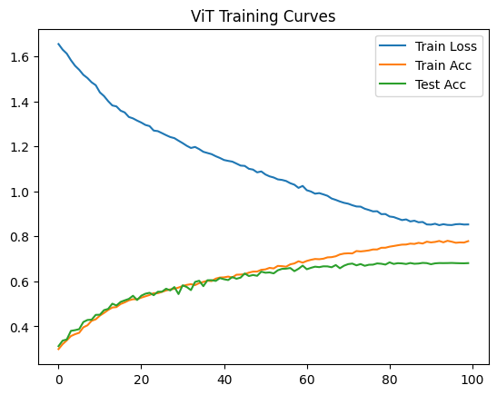
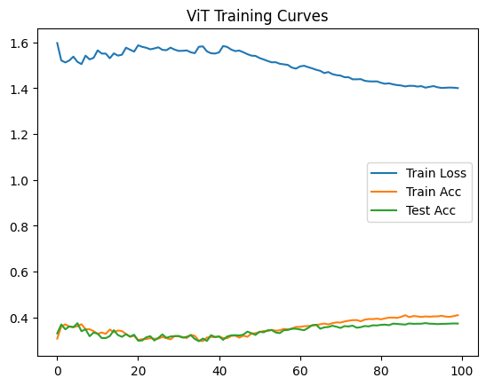
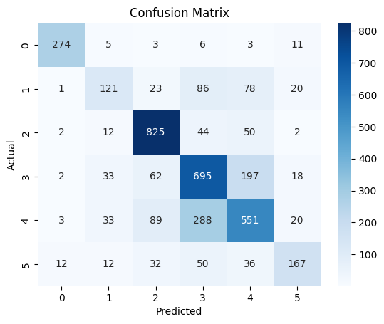
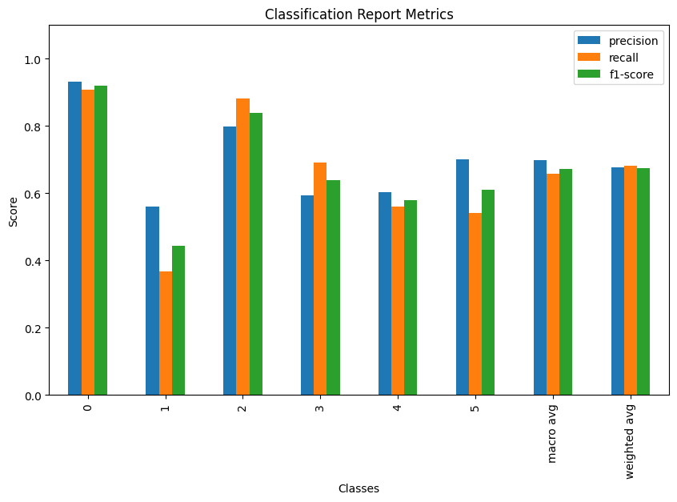

### **Dataset**

Facial Emotion Recognition: https://www.kaggle.com/datasets/sujaykapadnis/emotion-recognition-dataset/data

6 Classes:

- Ahegao: 1205 images
- Angry: 1313 images
- Happy: 3740 images
- Neutral: 4027 images
- Sad: 3934 images
- Surprise: 1234 images

Total images: 15453

---

### **Dataset Pre-processing**


#### **No handling for classes imbalances**
#### **Image sizes are standardized to 300x300:** The median size of images is 293x349, I chose 300x300 as the standard for all adding padding for those smaller than the standard and cropping those that are larger
#### **Images split into 75% Train & 25% Test**
#### **Transformations on training set:** Including [Horizontal flip, Affine, Rotation, Normalization, ..]

---

### **Model Description**

Vision Transformer model implemented from scratch using PyTorch includes:

**Patch Embedding**

- The input image is divided into non-overlapping patches using 2D convolution and projecting into a determined embedding dimension
- The patches are flattened
- A learnable (CLS Token) is prepended to the patch sequence
- Learnable position embeddings are added to each patch embedding to retain spatial information

**Transformer Encoder**

The body of the model consisting of stacked Transformer encoder layers. Each layer uses:

- Multi-head self-attention
- Feed-forward network (MLP)
- Layer normalization and GELU activation

**MLP Head**

A small MLP head predicts the class probabilities using:

- Layer normalization
- Dense layer --> GELU --> Dropout
- Dense layer --> number of emotion classes

**Parameters**

- Patch size: 15×15
- Embedding dimension: 192
- Transformer encoder layers: 8
- Attention heads: 3
- Classification token
- Position embeddings

Unlike CNNs, ViTs process images as sequences of patches and learn relationships using self-attention mechanisms.

---

### **Training Setup**

Optimizer: AdamW with weight decay applied
Loss function: CrossEntropy with label smoothing for better generalization
Learning Rate Scheduling
Epochs: 100

---

### **Training Results**




| Epoch | Train Loss | Train Acc | Test Acc |
|-------|------------|-----------|----------|
| 1     | 1.6550     | 0.2988    | 0.3120   |
| 10    | 1.4719     | 0.4313    | 0.4511   |
| 20    | 1.3146     | 0.5208    | 0.5171   |
| 30    | 1.2253     | 0.5724    | 0.5435   |
| 40    | 1.1485     | 0.6171    | 0.6146   |
| 50    | 1.0886     | 0.6513    | 0.6430   |
| 60    | 1.0243     | 0.6833    | 0.6699   |
| 70    | 0.9490     | 0.7236    | 0.6697   |
| 80    | 0.8992     | 0.7495    | 0.6746   |
| 90    | 0.8530     | 0.7764    | 0.6811   |
| 100   | 0.8530     | 0.7788    | 0.6811   |


Despite not using pretrained weights, the model achieves ~68% test accuracy.

---

### **Key Observations**

- Vision Transformers can learn from scratch on medium-sized datasets, but require careful optimization and tuning
- Results improved significantly:

.            |   Before  |   After   |
-------------|-----------|-----------|
Heads        |      8    |      3    |
Encoder Layers|     4    |      8    |
Regularization|     -    |    Yes    |
LR Scheduler|     -      |    Yes    |
Dataset Augmentation| -  |    Yes    |
Embedding Dims|  768     |    192    |
Patch Size  |   20x20    |   15x15   |
Results|||

---

### **Sample Results for final model (also in notebook)**

**Confusion Matrix**



**Recal, Precision & F1 Scores**



---

### **How to run**

1. Clone the repository:

```bash
git clone https://github.com/karimm-ai/ViT-emotion-recognition.git
```

2. Create a virtual environment (Optional but recommended)

3. Install requirements

```bash
pip install -r requirements.txt
```

4. Install torch or torch cuda. I use the below torch cuda wheel but it's dependent on the GPU. Mine is RTX5070 8GB.

```bash
pip install --pre torch torchvision torchaudio --index-url https://download.pytorch.org/whl/nightly/cu128
```

5. Run notebook cells

---

### **Future Improvements**

- Using pretrained ViT
- Balancing dataset
- Hyperparameter tuning

---

This project is for educational and research purposes.

---